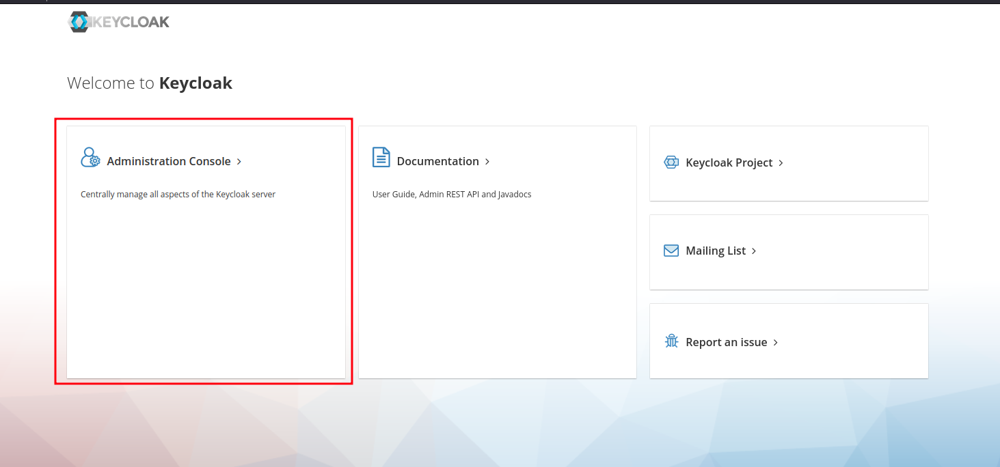
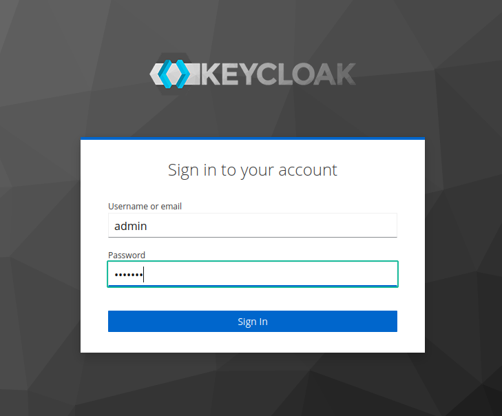
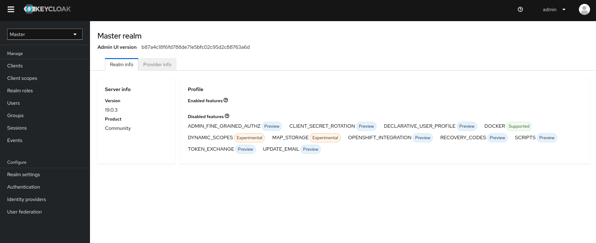
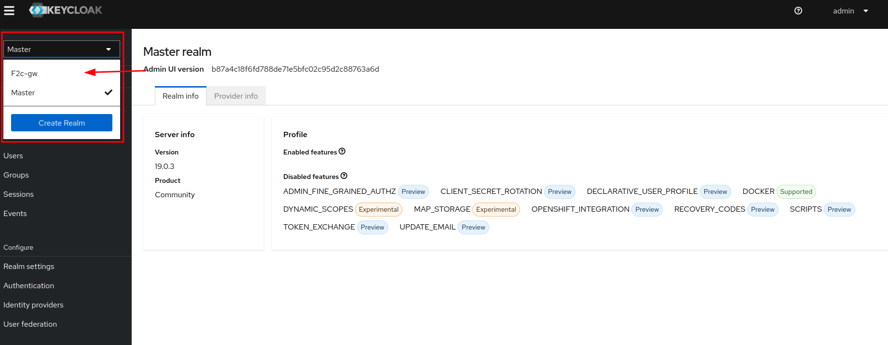
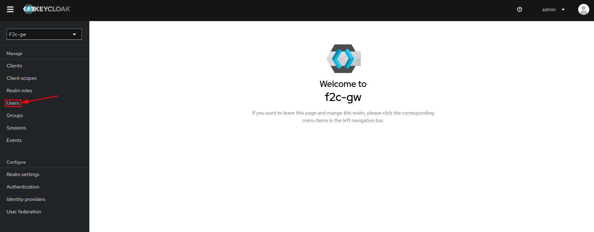
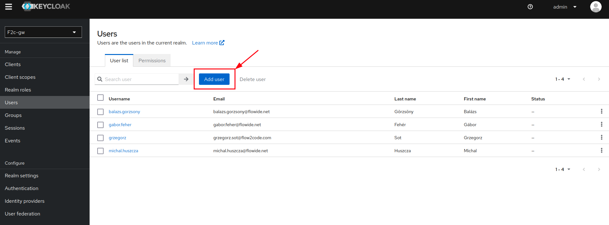
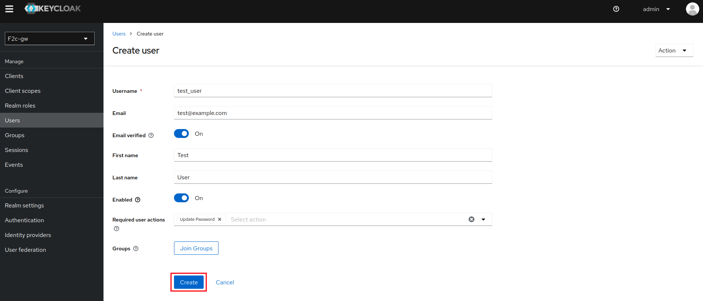
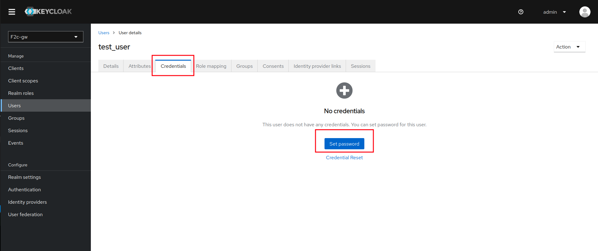
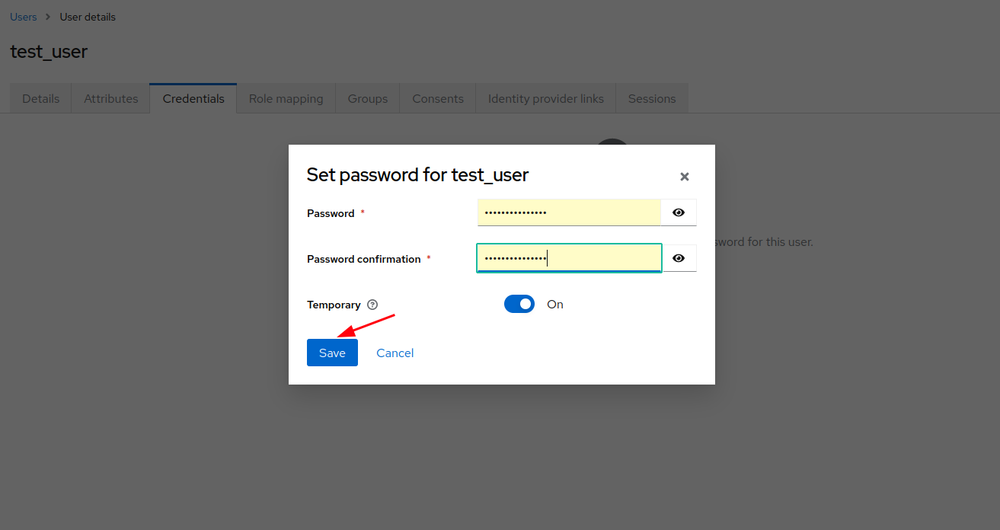

# User Account Setup
This section covers basic account setup that will allow you to begin your journey with FlowWide Workbench!
(log_in_adm)=
## Log in as admin
First of all you need to log in as admin to [Keycloack](https://www.keycloak.org/)
To do it, you need to go to sub-url on your subinstance of workbench eg. <https://yourInstanceHere-gw.flowide.net/auth>.
For purpose of this documentation we will be using *f2c* instance so <https://f2c-gw.flowide.net/auth>

After opening the url you will be able to chose **Administration Console** as shown on the image below:

Next step is to log in as admin with **Your Provided Credentials**:

If everything went fine you should see a screen simmilar to this:

(create_user)=
## Create new user

To create a new user you need to go to **your instance section**:

Then select **Users** tab on a sidebar menu:

Next select **Add User**

Next we are prepareing user's info:

1. Enter Username and user's email
2. If you are sure user's email is valid select that option, if You are not sure skipp it
3. Enter First and Last Name of the user
4. If you want to be able to access created account select that option
5. Here you can set up acctions user will be required to perform after first login - in our case selected option is *update password*
6. If you want to add your user to some group you can do it here.

Next we create user using **Create** button:

(set_up_psswd)=
## Set up new user's password

To set up new user's password and allow him to log in, you need to go to **Credentials** tab in user details page and click on the **Set password** button.

Then you are able to enter new password for the user, and set the *Temporary* flag, which forces user to change the password on first log in. To confirm  setting up a new password click **Save**.

***Good job now you can set up permissions to your new user! Go to [Permissions](permissions) part of this manual to do it!***
