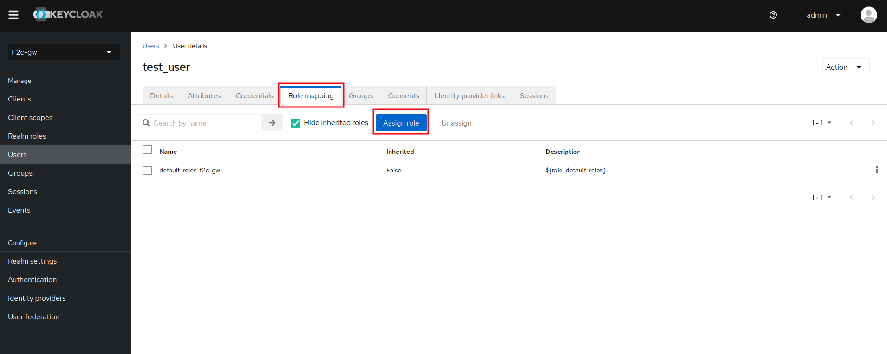
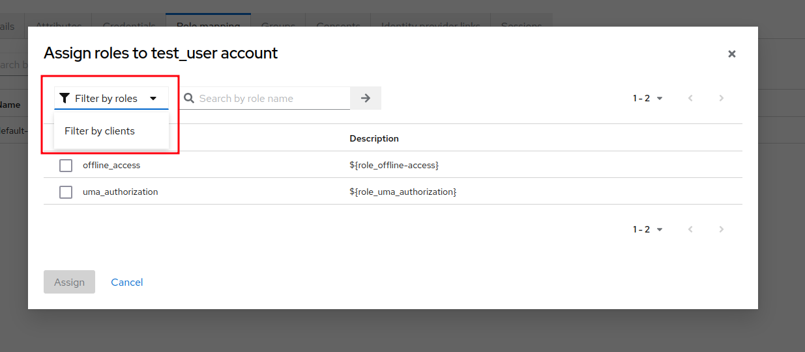

# Permissions
To be able to set up permissions for the user you need to be [logged in as Admin](log_in_adm).
(add_roles)=
## Add Roles

On selected user go to **Role Mapping** tab in *User details* menu, then click on **Assign role** button.

Next you can choose role's to be assigend and confirm.

It is worth to note that some roles are hidden behind a filter. To display them you need to select filters you want from the filter menu.

